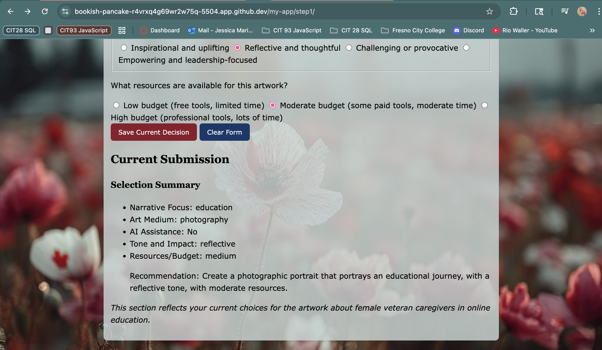

## Decision Focus

- The focus of this app is to guide creative decision-making for female veteran caregiver narratives.  
- Users input their preferences (narrative focus, art medium, AI assistance, tone, and budget), and the app produces a tailored recommendation that connects storytelling with available resources.

## Decision Logic

### Helper Functions

- **Narrative Focus**  
  - When the user selects “education”, then the narrative is framed as an educational journey.  
  - When the user selects “caregiving”, then the narrative emphasizes caregiving responsibilities.  
  - When the user selects “balance”, then the narrative explores balancing dual identities.  
  - When the user selects “leadership”, then the narrative highlights emerging leadership roles.  

- **Art Medium**  
  - When “digital” is chosen, then the app suggests using illustration or AI-assisted tools.  
  - When “mixed” is chosen, then the app suggests collage or hybrid forms.  
  - When “painting” is chosen, then the app suggests traditional paint methods.  
  - When “photography” is chosen, then the app suggests photographic representation.  

- **AI Assistance**  
  - When the AI checkbox is selected, then the output reflects AI integration.  
  - When unchecked, then the output reflects only human-made media.  

- **Tone and Impact**  
  - Inspirational → output emphasizes uplifting stories.  
  - Reflective → output emphasizes thoughtful, personal perspectives.  
  - Challenging → output emphasizes provocative or disruptive imagery.  
  - Empowering → output emphasizes leadership and strength.  

- **Resources/Budget**  
  - Low → output suggests free tools and limited scope.  
  - Medium → output suggests moderate resources.  
  - High → output suggests professional-level resources and detail.  

### Final Decision

The app combines all the above factors into a single message.  
- If the combination involves **high budget** and **empowering tone**, then the output encourages a bold, professional-level art narrative.  
- If the combination involves **low budget** and **reflective tone**, then the output suggests simple but thoughtful approaches.  
- In all other cases, the app defaults to a balanced recommendation summarizing the choices.  

### Example Outputs

**Example 1**  
Inputs: Narrative = Education, Medium = Digital, AI = Yes, Tone = Inspirational, Budget = Medium  
Output: *Create an uplifting digital illustration of a female veteran caregiver’s educational journey, using AI to enhance details with moderate resources.*  

**Example 2**  
Inputs: Narrative = Caregiving, Medium = Painting, AI = No, Tone = Reflective, Budget = Low  
Output: *Paint a thoughtful piece highlighting the caregiving role, using simple tools and limited resources.*  

**Example 3**  
Inputs: Narrative = Leadership, Medium = Photography, AI = No, Tone = Empowering, Budget = High  
Output: *Produce a bold photographic portrait of leadership, with professional quality and strong visual impact.*  

---

## Screenshot of Step 1 Output

